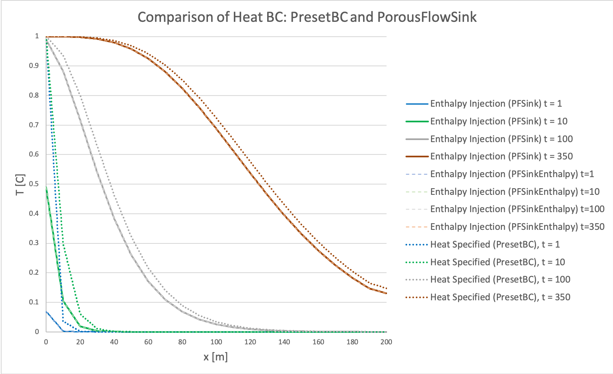
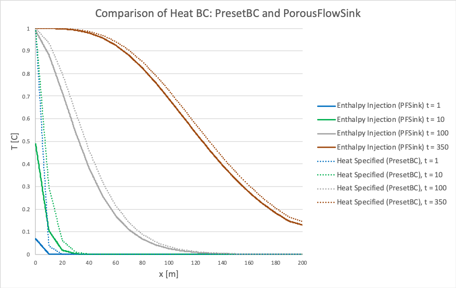

# Overview

This repository compares two approaches to injecting fluid at a fixed flow rate and temperature in MOOSE's PorousFlow Thermo-hydro simulations. The first approach fixes the temperature at the inlet using a *DirichletBC*, while the second approach injects an amount of enthalpy based on the inlet fluid temperature. This second, enthalpy-based approach can be done in the 'stupid way' using a *PorousFlowSink* BC or it can be done more effectively with the newly-developed *PorousFlowSinkEnthalpy* boundary condition. The advantage of *PorousFlowSinkEnthalpy* is that the inlet temperature can be specified, even when the EOS is complicated, which would not allow an a-priori calcualation of the enthalpy flow rate. The *PorousFlowSinkEnthalpy* is in the following branch: https://github.com/andrsd/moose/tree/ent-inj-bc. Many thanks to David Andrs for his development of this!


## Parameters

We use the SimpleFluidProperties equation of state: Viscosity = 1 Pa-s, heat capacity = 4200 J/kg/K, reference density = 1000 kg/m3, bulk modulus of the fluid = 2e9 Pa.
The rock material properties are: permeability = 10^-7 m2, porosity = 0.1, rock density = 2500 kg/m3, specific heat capacity = 800, dry thermal conductivity = 2.1, wet thermal conductivity = 1.8.
The domain is 200 x 1 x 200 m and the area of the injection and extraction BCs are 200 m2.

## Three Input Files

The domain is initially at zero degrees and has a BCs that encourage a flow of 40000 kg/s, or 40 m3/s, across it. After the initialization period, the inlet temperature is raised in one of three ways: (a) the temperature at the boundary is raised to 1 degree (*input\_PresetBC.i*), (b) the relevant enthalpy injection rate is specified (i.e. the enthalpy from 40000 kg/s at 1 degree, in *input\_PFSink.i*), or (c) in *input_enthalpy.i* the temperature is specified (using the *T_in* parameter), which automatically calculates the correct enthalpy of the fluid at the inlet. The outflow boundary produces fluid at 40000 kg/s and allows temperature to leave with the fluid. This is achieved by having very similar *PorousFlowSink* cards at the outlet for temperature and pressure. The only difference are the variable names (temp instead of pp) and that *use\_enthalpy* is included for the temperature condition.

### *input\_PresetBC.i*

```
  [./injection]
    type = PorousFlowSink
    variable = pp
    boundary = left
    flux_function = -200
    fluid_phase = 0
    use_mobility = false
    save_in = fluxes_in
  [../]
  [./injection_heat]
    type = PresetBC
    variable = temp
    boundary = left
    value = 1.
    save_in = heat_fluxes_in
  [../]
```

### *input\_PFSink.i*

The enthalpy injection rate is the product of the flow rate, the fluid heat capacity, and the temperature change = 40,000 kg/s * 4200 J/kg/K * 1 K = 1.68e8 J/s. Dividing by the area gives the flux\_function = 840000 J/m2/s for the PorousFlowSink BC in *input\_PFSink.i*. Note that this was an a-priori calculation, but it would not be possible for EOS where the enthalpy is a more complex function of pressure or temperature (for example [Water97FluidPropertiesFluid](https://www.mooseframework.org/source/userobjects/Water97FluidProperties.html), or CO2 or methane).

```
  [./injection]
    type = PorousFlowSink
    variable = pp
    boundary = left
    flux_function = -200 ## injeciton of fluid at 200 kg/m2/s
    fluid_phase = 0
    use_mobility = false
    save_in = fluxes_in
  [../]
  [./injection_heat]
    type = PorousFlowSink
    variable = temp
    boundary = left
    flux_function = -840000. #This is the amount of enthalpy calculated a priori
    fluid_phase = 0
    use_mobility = false
    use_enthalpy = false #NOTE this is false since a priori calculation was already done for flux_function
    save_in = heat_fluxes_in
  [../]
```

### *input\_enthalpy.i*

```
[./injection]
  type = PorousFlowSink
  variable = pp
  boundary = left
  flux_function = -200 ## injection of fluid at 200 kg/m2/s
  fluid_phase = 0
  use_mobility = false
  save_in = fluxes_in
[../]
[./injection_heat]
  type = PorousFlowSinkEnthalpy
  variable = temp
  boundary = left
  flux_function = -200 #NOTE - flux_function matches the [./injection] card above
  pressure = pp
  T_in = 1 # Temp of inlet fluid is specified here
  fp = simple_fluid
  save_in = heat_fluxes_in
[../]
```

### Outflow Boundary Conditions

The following BCs are used in all the input files, at the outflow boundary.

```
  [./production]
    type = PorousFlowSink
    variable = pp
    boundary = right
    flux_function = 200 ## extraction of fluid at 200 kg/m2/s
    fluid_phase = 0
    use_mobility = false
    save_in = fluxes_out
  [../]
  #Note that production_heat is identical to production at outflow boundary
  #except that variable = temp and use_enthalpy = true
  [./production_heat]
    type = PorousFlowSink
    variable = temp
    boundary = right
    flux_function = 200
    fluid_phase = 0
    use_mobility = false
    use_enthalpy = true
    save_in = heat_fluxes_out
  [../]
```

## Results and Conclusions

The figure below shows temperature versus distance along the flow path, x. Results are shown at t = 1, 10, 100, and 350 seconds. The solid lines are the results when an enthalpy injection rate is specified (with PorousFlowSink), the dashed lines are when the inlet enthalpy is calculated from a specified temperature with *PorousFlowSinkEnthalpy*, and the dotted lines are results when the temperature is directly specified (with PresetBC).
The two enthalpy injection approaches match perfectly, which shows that *PorousFlowSinkEnthalpy* is working correctly. At early times, the enthalpy injection approach has to heat up the element at the injection. By t = 100, the temperature at the inlet is approximately 1 degree C.
On the other hand, when the temperature at the inlet is fixed to 1 degree, the temperature gradient is very large at the inlet, essentially providing an unrealistically large amount of energy at early times.
By the time the simulation has reached later times (t >=350 s), the differences between the two approaches are minor.
It is likely that the enthalpy specification is more accurate than the fixed temperature BC, but the differences may be inconsequential depending on specifics of the problem (mesh size, time scale, length scale, material properties, etc.).
*PorousFlowSinkEnthalpy* appears to be the best approach to specifying BCs of this nature. (Note the graph and its data are in *DataAnalysis.xlsx.*)




<!-- ## Overview

This repository compares two approaches to injecting fluid at a fixed flow rate and temperature in MOOSE's PorousFlow Thermo-hydro simulations. The first approach fixes the temperature at the inlet using a DirichletBC, while the second approach injects an amount of enthalpy based on the inlet fluid temperature using a PorousFlowSink BC.

## Details

The domain is initially at zero degrees and has a BCs that encourage a flow of 40000 kg/s, or 40 m3/s, across it (which is accomplished in *input\_initialization.i*). After the initialization period, the inlet temperature is raised in one of two ways: (a) the temperature at the boundary is raised to 1 degree (*input\_PresetBC.i*) or (b) the relevant enthalpy injection rate is specified (i.e. the enthalpy from 40000 kg/s at 1 degree, in *input\_PFSink.i*). The outflow boundary produces fluid at 40000 kg/s and allows temperature to leave with the fluid. This is achieved by having very similar *PorousFlowSink* cards at the outlet for temperature and pressure. The only difference are the variable names (temp instead of pp) and that *use\_enthalpy* is included for the temperature condition.

```
  [./production]
    type = PorousFlowSink
    variable = pp
    boundary = right
    flux_function = 200 ## extraction of fluid at 200 kg/m2/s
    fluid_phase = 0
    use_mobility = false
    save_in = fluxes_out
  [../]
  #Note that production_heat is identical to production at outflow boundary
  #except that variable = temp and use_enthalpy = true
  [./production_heat]
    type = PorousFlowSink
    variable = temp
    boundary = right
    flux_function = 200
    fluid_phase = 0
    use_mobility = false
    use_enthalpy = true
    save_in = heat_fluxes_out
  [../]
```

### Parameters

We use the SimpleFluidProperties equation of state: Viscosity = 1 Pa-s, heat capacity = 4200 J/kg/K, reference density = 1000 kg/m3, bulk modulus of the fluid = 2e9 Pa.
The rock material properties are: permeability = 10^-7 m2, porosity = 0.1, rock density = 2500 kg/m3, specific heat capacity = 800, dry thermal conductivity = 2.1, wet thermal conductivity = 1.8.
The domain is 200 x 1 x 200 m and the area of the injection and extraction BCs are 200 m2.

### <a name="some-id"></a> A-priori calculation of enthalpy injection rate

The enthalpy injection rate is the product of the flow rate, the fluid heat capacity, and the temperature change = 40,000 kg/s * 4200 J/kg/K * 1 K = 1.68e8 J/s. Dividing by the area gives the flux\_function = 840000 J/m2/s for the PorousFlowSink BC in *input\_PFSink.i*.

```
  [./injection_heat]
    type = PorousFlowSink
    variable = temp
    boundary = left
    flux_function = -840000. #This is the amount of enthalpy calculated a priori
    fluid_phase = 0
    use_mobility = false
    use_enthalpy = false #NOTE this is false since a priori calculation was already done for flux_function
    save_in = heat_fluxes_in
  [../]
```

### Results and Interpretation

The figure below shows temperature versus distance along the flow path, x. Results are shown at t = 1, 10, 100, and 350 seconds. The solid lines are the results when an enthalpy injection rate is specified (with PorousFlowSink), and the dotted lines are results when the temperature is directly specified (with PresetBC).
At early times, the enthalpy injection approach has to heat up the element at the injection. By t = 100, the temperature at the inlet is approximately 1 degree C.
On the other hand, when the temperature at the inlet is fixed to 1 degree, the temperature gradient is very large at the inlet, essentially providing an unrealistically large amount of energy at early times.
By the time the simulation has reached later times (t >=350 s), the differences between the two approaches are minor.
It is likely that the enthalpy specification is more accurate than the fixed temperature BC, but the differences may be inconsequential depending on specifics of the problem (mesh size, time scale, length scale, material properties, etc.).




## Injecting Enthalpy with the Real Water EOS

The previous [example](#some-id) used the [SimpleFluidProperties EOS](https://www.mooseframework.org/source/userobjects/SimpleFluidProperties.html), which allowed us to calculate the enthalpy injection rate a priori. If we want to use a more complex EOS, like [Water97FluidPropertiesFluid](https://www.mooseframework.org/source/userobjects/Water97FluidProperties.html), then we cannot calculate the enthalpy injection rate a priori, because we do not know how the enthalpy will evolve as a function of the changin

### Andy's suggestions

#### SpecificEnthalpyAux

Look into *SpecificEnthalpyAux*. This seems to take the value of specific enthalpy, h [J/kg].

```
[AuxKernels]
  [./pressure_ak]
    type = ConstantAux
    variable = pressure
    value = 10e6
  [../]
  [./temperature_ak]
    type = ConstantAux
    variable = temperature
    value = 400.0
  [../]
  [./specific_enthalpy_ak]
    type = SpecificEnthalpyAux
    variable = specific_enthalpy
    fp = eos
    p = pressure
    T = temperature
  [../]
[]
```

This AuxKernel reports the value of specific enthalpy, h [J/kg]. For the [SimpleFluidProperties EOS](https://www.mooseframework.org/source/userobjects/SimpleFluidProperties.html), we can confirm that if porepressure_coefficient = 0, h = Cv*T = (4186 J/kg/K)(400 K) = 1.67e6 J/kg. This shows that the reference temperature for the SimpleFluidProperties is T = 0, i.e. h = 0 when T = 0. See *specific_enthalpy_aux_SimpleFluidProperties.i*.

Is the reference temperature also 0 for the Water97FluidProperties? **No, T = 273.15, P = 42000 Pa leads to h = 0.57 J/kg, very close to zero**. Check in *specific_enthalpy_aux_Water97.i*. When inspecting *Water97FluidProperties.C*, the enthalpy calculation *h_from_p_T(P,T)* checks which region the P and T fall into, which seems to decide if the water is a liquid, gas, or supercritical (and maybe some other region too). Depending on which region it falls into, the enthalpy is calculated with something like the following:

```
enthalpy = _Rw * _T_star[0] * dgamma1_dtau(pi, tau);
```

**The next question is how to access the enthalpy at a nodal point within a domain**. Look at the work done in my *THM_single_phase/THM_clean.i* directory. I can confirm that this is done correctly with [Postprocessors] (probably with a PointValue but SideAverageValue and FunctionValuePostprocessor also exist). The steps are:

- Copy *input_PresetBC.i* to *output_enthalpy.i*, and add a PointValue or SideAverageValue [Postprocessor] that outputs the specific enthalpy from SpecificEnthalpyAux [AuxKernel].
  - Confirm that it gives the enthalpy corresponding to the inlet and outlet temperature at the inlet and outlet sides. The result for h can be calculated a priori since the SimpleFluidProperties EOS is used.
- Then copy these [Postprocessors] and [AuxKernels] to a file based on *input_PFSink.i*.
  - Check to see that the specific enthalpy approaches that of h(Tin) from before, again using SimpleFluidProperties.
- Then alter this input file to specify the input enthalpy based on the local pressure and the specified inlet Temperature, using a function or an AuxKernel like Phil Schaedle recommends. See if it is possible to specify inlet T but read the inlet P from the node in this approach. If so, then it can be used later with the Water97FluidProperties to inject enthalpy at a fixed Tin.

```
[./effective_fluid_pressure_at_wellbore]
  type = PointValue
  variable = effective_fluid_pressure
  point = '0 0 0'
  # execute_on = timestep_begin
  execute_on = timestep_end
  use_displaced_mesh = false
[../]
```

### To do

- Look for *SpecificEnthalpyAux* example. Can I output the enthalpy at a fixed P, T?

### David Andrs (from INL) branch with solution

- He wrote an input file, which is compatible with his branch (https://github.com/andrsd/moose/tree/ent-inj-bc), called *input_enthalpy.i*. That mimics *input_PFSink.i*, but the difference is the boundary condition is:

```
[./injection_heat]
  type = PorousFlowSinkEnthalpy
  variable = temp
  boundary = left
  flux_function = -200 ## The flux_function matches the [./injection] card above!
  pressure = pp
  T_in = 1 ## This is the inlet temperature.
  fp = simple_fluid
  save_in = heat_fluxes_in
[../]
```

This is different from the *input_PFSink.i*:

```
[./injection_heat]
  type = PorousFlowSink
  variable = temp
  boundary = left
  flux_function = -840000. #This is the amount of enthalpy calculated a priori
  fluid_phase = 0
  use_mobility = false
  use_enthalpy = false #NOTE this is false since a priori calculation was already done for flux_function
  save_in = heat_fluxes_in
[../]
```

- How to check out his branch without messing up the rest of my MOOSE?
  - A branch is still attached to the main 'trunk' of the code, and depends on it
  - A fork (i.e. another way of saying clone or copy) copies all the code (including the branches) and would be able to stand on its own, if the main trunk were deleted or altered.
  - If Andrs has a branch, I should be able to check it out. -->
